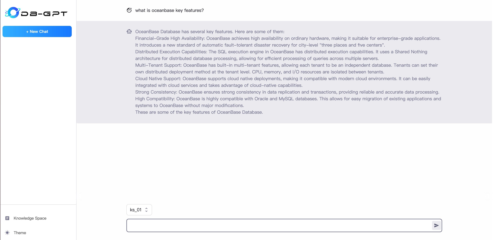

KBQA
==================================
DB-GPT supports a knowledge question-answering module, which aims to create an intelligent expert in the field of databases and provide professional knowledge-based answers to database practitioners.



## KBQA abilities


```{admonition} KBQA abilities
* Knowledge Space.
* Multi Source Knowledge Source Embedding.
* Embedding Argument Adjust
* Chat Knowledge
* Multi Vector DB
```


## Steps to KBQA In DB-GPT

#### 1.Create Knowledge Space
If you are using Knowledge Space for the first time, you need to create a Knowledge Space and set your name, owner, description.


#### 2.Create Knowledge Document
DB-GPT now support Multi Knowledge Source, including Text, WebUrl, and Document(PDF, Markdown, Word, PPT, HTML and CSV).
After successfully uploading a document for translation, the backend system will automatically read and split and chunk the document, and then import it into the vector database. Alternatively, you can manually synchronize the document. You can also click on details to view the specific document slicing content.
##### 2.1 Choose Knowledge Type:


##### 2.2 Upload Document:


#### 3.Chat With Knowledge


#### 4.Adjust Space arguments
Each knowledge space supports argument customization, including the relevant arguments for vector retrieval and the arguments for knowledge question-answering prompts.
##### 4.1 Embedding
Embedding Argument


```{tip} Embedding arguments
* topk:the top k vectors based on similarity score.
* recall_score:set a threshold score for the retrieval of similar vectors.
* recall_type:recall type. 
* model:A model used to create vector representations of text or other data.
* chunk_size:The size of the data chunks used in processing.
* chunk_overlap:The amount of overlap between adjacent data chunks.
```

##### 4.2 Prompt
Prompt Argument


```{tip} Prompt arguments
* scene:A contextual parameter used to define the setting or environment in which the prompt is being used.
* template:A pre-defined structure or format for the prompt, which can help ensure that the AI system generates responses that are consistent with the desired style or tone.
* max_token:The maximum number of tokens or words allowed in a prompt. 
```

#### 5.Change Vector Database

```{admonition} Vector Store SETTINGS
#### Chroma
* VECTOR_STORE_TYPE=Chroma
#### MILVUS
* VECTOR_STORE_TYPE=Milvus
* MILVUS_URL=127.0.0.1
* MILVUS_PORT=19530
* MILVUS_USERNAME
* MILVUS_PASSWORD
* MILVUS_SECURE=

#### WEAVIATE
* WEAVIATE_URL=https://kt-region-m8hcy0wc.weaviate.network
```